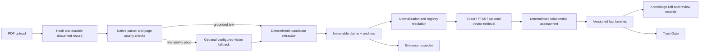

# Project SuperJoin architecture

Project SuperJoin is a local, evidence-first temporal fact layer. Its central design choice is to keep three different things separate:

1. **Source claims** are immutable observations of what a document says. A claim keeps its raw wording, document/page identity, extraction method, and evidence anchors.
2. **Claim interpretations** are append-only, deterministic projections of a claim. They add normalized decimals, units, periods, entity/predicate mappings, security flags, and grounding status without rewriting the source claim.
3. **Canonical fact versions** group compatible interpretations into a queryable fact family. A version records the evidence membership, alternatives, relationship conclusions, review dependence, and knowledge revision that justify its current state.

This separation lets the product answer two different questions honestly: “What did the source assert?” and “What may a downstream system safely use for this context and policy?” The Trust Gate answers the second question and returns `block`, `needs_context`, `needs_review`, or `allow` with evidence and reason codes.

## Runtime flow

The implementation is one FastAPI process with a SQLite WAL database and a static React/Vite client. A background task performs document work, while `run_events` makes progress, cancellation, retry, and history durable. Publication is a transaction over claims, interpretations, relationships, fact versions, and the workspace revision. The same runtime is therefore useful in a Docker demo and understandable in an interview.

## Why these technologies

- **SQLite** supplies transactions, foreign keys, WAL, and FTS5 without a service dependency. Stored normalized vectors are scanned with NumPy only over the bounded workspace population. There is no claim of ANN performance.
- **pdfplumber** is the current compatible primary parser because the local smoke comparison found comparable native text output while PyMuPDF's AGPL/commercial licensing is unresolved for distribution. The benchmark harness and decision are documented in [`PARSER_SELECTION.md`](PARSER_SELECTION.md); a full source-verified corpus comparison remains an explicit evidence task.
- **FastAPI/Pydantic** keeps the API contract typed and exposes OpenAPI automatically. Provider calls use a small OpenAI-compatible adapter instead of a framework that hides prompts, retries, or budgets.
- **React/Vite** keeps the evaluator path fast and static. The UI is intentionally an evidence inspector and review workspace rather than a chatbot. The main interaction is a dense facts table with an adjacent evidence/trust panel.

## What was deliberately removed

The assignment does not benefit from Neo4j, a graph UI, Redis/Celery, Kubernetes, microservices, LangChain, autonomous web research, learned authority scores, or a generic event-sourcing framework. These would increase setup and failure surface without improving the required evidence, temporal, review, or Trust Gate behavior. The application keeps the useful audit properties as ordinary append-only relational records.

## Provider boundary

Extraction, reasoning, vision, and embeddings have independent model/base URL/key settings. Document text is passed as explicitly delimited untrusted content; it never becomes a system instruction and cannot select a tool, endpoint, budget, or eligibility status. Responses are validated and budgeted before they can affect the claim pipeline. With no key, the seeded recorded dataset powers Demo Mode; with a configured endpoint, arbitrary PDFs can enter the same pipeline.

## State and revision model

The source PDF and source claim are retained. A new interpretation, registry correction, review, or document changes the current projection by publishing a new workspace knowledge revision. Older fact versions and review decisions remain addressable. When new evidence changes a reviewed fact family, the previous decision is marked stale; the strict Trust Gate will not silently reuse it.

